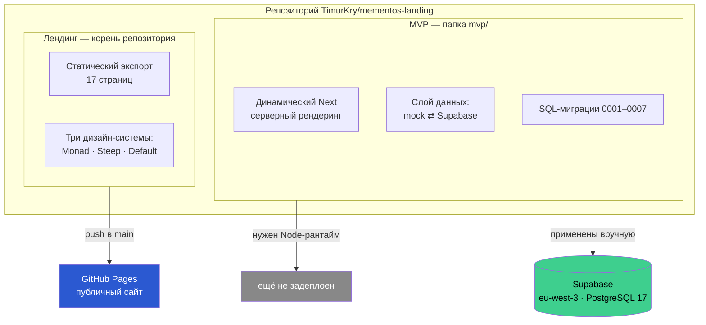
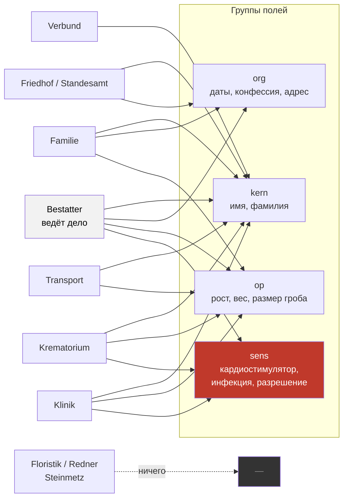
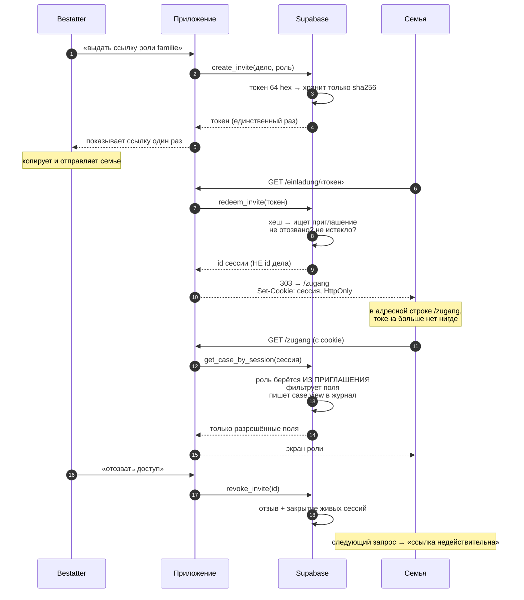
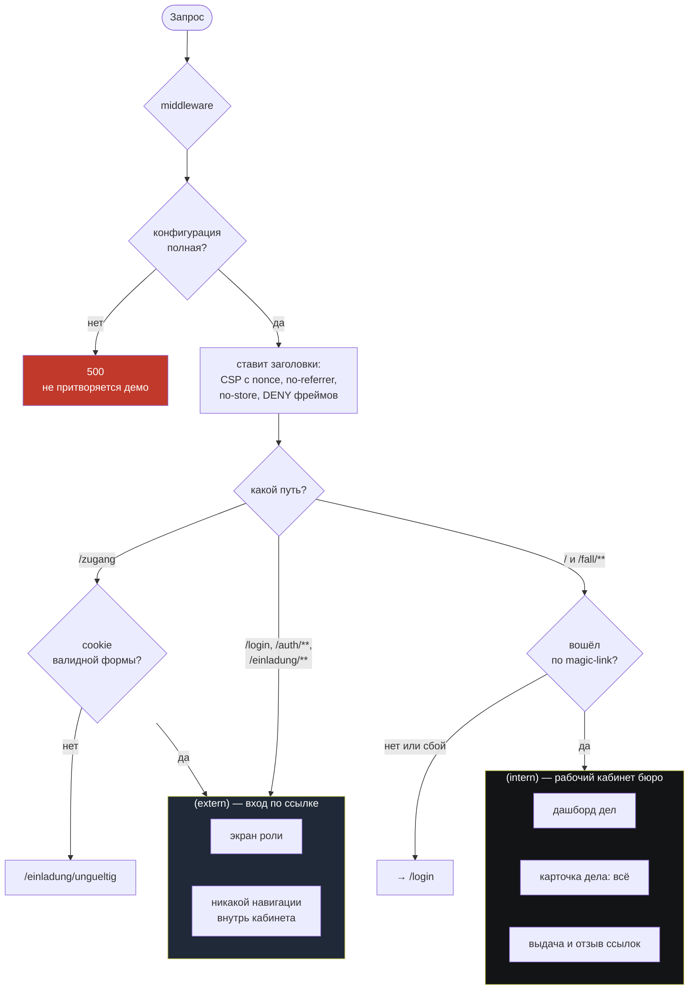
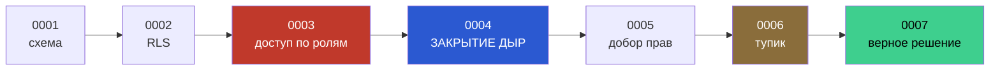
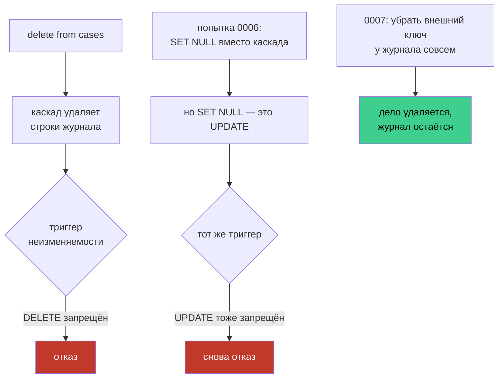
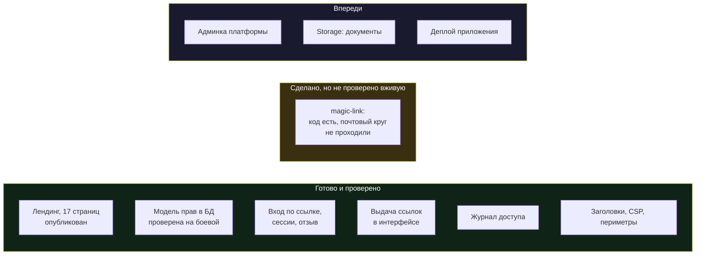
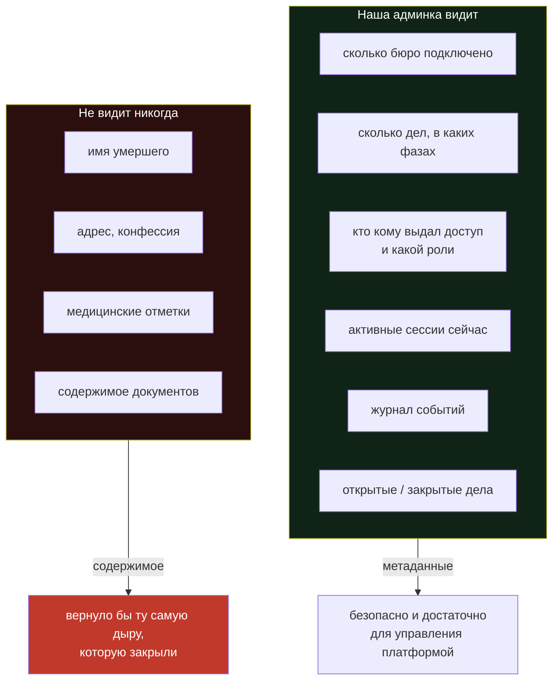
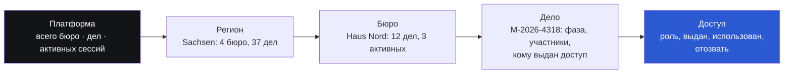

# MementoOS — где мы сейчас

Карта проекта на 27 июля 2026. Схемы отдельно по темам, чтобы не читать одну простыню.

---

## 1. Что вообще есть в репозитории

Два самостоятельных приложения в одном репозитории. Они не связаны кодом и деплоятся по-разному.



**Важно:** лендинг живой и опубликован. MVP работает локально, база подключена, но само приложение никуда не выложено — для него нужен сервер, GitHub Pages не подойдёт.

---

## 2. Модель данных

Один `Fall` (дело) — центр всего. Поля умершего разбиты на четыре группы, и именно группы решают, кто что видит.

```mermaid
erDiagram
    profiles ||--o{ cases : "владеет"
    cases ||--|| deceased : "1:1"
    cases ||--o{ participants : "участники"
    cases ||--o{ tasks : "задачи"
    cases ||--o{ documents : "документы"
    cases ||--o{ invites : "выданные ссылки"
    invites ||--o{ invite_sessions : "открытые сессии"
    cases ..o{ audit_log : "журнал, без внешнего ключа"

    profiles {
        uuid id PK "= auth.users"
        text org_name
    }
    cases {
        uuid id PK
        text ref "M-2026-431849"
        uuid owner FK
        enum phase "neu…abschluss"
    }
    deceased {
        text vorname "kern"
        text nachname "kern"
        date geburtsdatum "org"
        text konfession "org"
        text anschrift "org"
        int groesse_cm "op"
        int gewicht_kg "op"
        bool herzschrittmacher "sens"
        text infektionshinweis "sens"
        bool freigabe_einaescherung "sens"
    }
    invites {
        uuid id PK
        bytea token_hash "sha256, НЕ текст"
        enum role "никогда не bestatter"
        bool revoked
    }
    invite_sessions {
        uuid id PK "живёт в cookie"
        timestamptz expires_at "12 часов"
    }
    audit_log {
        text action
        jsonb detail "роль + группы полей"
    }
```

Обрати внимание на пунктир: `audit_log` **намеренно** без внешнего ключа на `cases`. Почему — в разделе 6.

---

## 3. Кто какие поля видит

Это ядро продукта. Одно дело хранится один раз, но каждая роль получает свой срез.



Два примера, проверенные на боевой базе:

| Роль | Получает | Не получает |
|---|---|---|
| **Familie** | имя, даты, конфессия, адрес, рост, вес, размер гроба | **ничего медицинского**, названия фирм-партнёров |
| **Krematorium** | имя, рост, вес, размер гроба, **кардиостимулятор, разрешение** | конфессия, адрес, дата рождения |

Ключевое: непозволенное поле **не приходит вообще**. Оно не скрыто в браузере — его нет в ответе сервера.

---

## 4. Как участник попадает в дело

Вход по ссылке, без аккаунта. Токен при этом не остаётся в адресной строке.



**Почему роль не передаётся аргументом.** Раньше передавалась — и это была дыра: держатель законной семейной ссылки мог запросить то же дело «от имени bestatter» и получить всё. Теперь роль читается из строки приглашения на сервере, а `id дела` наружу не отдаётся вообще.

---

## 5. Два периметра и что их стережёт



Периметры разделены не только правами, но и вёрсткой: у внешнего свой layout **без единой ссылки** в рабочий кабинет. Раньше общая шапка показывала приглашённой семье навигацию внутрь.

---

## 6. История миграций — включая два бага, найденных на боевой базе



**0003 была дырявой.** В PostgreSQL `CREATE FUNCTION` по умолчанию раздаёт право вызова роли `PUBLIC`. Функции фильтрации обходили RLS (`SECURITY DEFINER`), и права у них никто не отзывал — аноним мог вызвать их напрямую и получить всё. Проверено на боевой базе перед применением 0004: дыра была настоящей.

**0004 закрыла обе дыры.** Внутренние функции уехали в схему `app`, куда у анонима нет доступа; старые функции **удалены**, а не заменены (замена с новой сигнатурой оставила бы старую версию живой); токены стали храниться хешем; появились сессии и журнал.

**0005 — недобор прав.** Две триггерные функции создаются в 0004 уже после блока прав и остались без ACL. Не эксплуатировалось, но инвариант надо держать: известный шум прячет настоящий сигнал.

**0006 → 0007 — самое интересное.** Обнаружилось, что **дело нельзя было удалить вообще**:



Два правильных по отдельности правила заклинивали друг друга. Для отрасли под DSGVO это блокер — статья 17 требует возможности удалить персональные данные. Решение: журнал аудита не должен иметь внешнего ключа на изменяемые данные, потому что он **обязан переживать** то, на что ссылается. Персональных данных в журнале нет — только роль, группы полей, сессия и время.

Проверено: после удаления дела все таблицы с персональными данными пусты, журнал цел.

---

## 7. Что готово, что нет



---

## 8. Админка платформы — что предлагаю строить

Граница, которую предлагаю зафиксировать раз и навсегда:



Вложенность, как ты иописывал — сверху сводка, вглубь по клику:



На каждом уровне — только счётчики и связи. На самом глубоком уровне видно, **что доступ существует и кем используется**, но не то, что за ним лежит.
